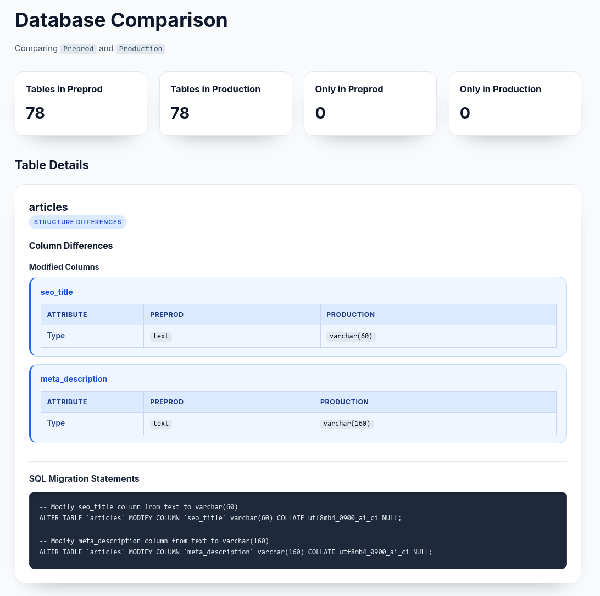

# Database Comparison & SQL Migration Tool

A PHP-based web application that compares two MySQL databases, identifies schema differences, and generates SQL migration statements using AI to synchronize them.

## Description

This tool automates the process of comparing database schemas between a source and target database. It analyzes tables, columns, indexes, foreign keys, and metadata, then leverages the Anthropic Claude AI model to generate precise SQL statements needed to make the target database match the source database structure.

The application stores all comparison data in a dedicated storage database for caching and historical reference, ensuring efficient re-runs and detailed audit trails.

## Features

- **Schema Comparison**: Automatically compares table structures between two databases
- **Comprehensive Difference Detection**: Identifies differences in:
  - Table existence and metadata (engine, collation)
  - Column definitions (type, constraints, defaults)
  - Foreign key constraints
  - Indexes and primary keys
- **AI-Powered SQL Generation**: Uses Claude Haiku model to generate accurate MySQL migration statements
- **Visual Diff Interface**: Clean, responsive web UI showing all differences with color-coded indicators
- **Storage Database Caching**: Maintains snapshots for historical comparison and efficient processing
- **Error Handling**: Robust error handling with detailed error messages
- **Secure API Integration**: Secure communication with Anthropic's API using environment-based configuration

## Installation

### Prerequisites

- PHP 8.0 or higher
- MySQL 5.7 or higher (for both source and target databases)
- A separate MySQL database for storing comparison snapshots
- Anthropic API key

### Steps

1. **Clone the repository**
   ```bash
   git clone git@github.com:rakotomandimby/database-diff.git 
   cd database-diff
   ```

2. **Set up the storage database**
   ```bash
   mysql -u root -p < database-structure.sql
   ```
   This creates all necessary tables in your storage database.

3. **Configure the application**
   ```bash
   cp config.sample.php config.php
   ```
   Edit `config.php` with your database credentials and API key.

4. **Set appropriate permissions**
   ```bash
   chmod -R 755 public/
   chmod -R 755 src/
   ```

5. **Serve the application**
   ```bash
   php -S localhost:8000 -t public/
   ```
   Or configure your web server (Apache, Nginx) to serve the `public/` directory.

## Usage

### Basic Usage

1. Open the application in your web browser: `http://localhost:8000`
2. The application automatically:
   - Connects to both configured databases
   - Captures schema snapshots
   - Compares schemas and identifies differences
   - Generates SQL migration statements using AI
   - Displays results in an interactive UI

### Understanding the Output



The comparison results are displayed in sections:

- **Summary Grid**: Shows table counts for each database
- **Table Existence Differences**: Lists tables only in source or target
- **Table Details**: For each differing table, shows:
  - Column differences (added, removed, modified)
  - Metadata differences (engine, collation)
  - Foreign key differences
  - Generated SQL migration statements

### SQL Migration Statements

The generated SQL statements are displayed in a code block under "SQL Migration Statements" for each table. These statements are ready to execute on the target database to synchronize it with the source.

**Important**: Always review and test generated SQL statements in a development environment before applying to production.

## Configuration

### config.php

```php
<?php

// Anthropic API key for SQL generation
$llmApiKey = 'your-api-key-here';

// Source database configuration
$db1Config = [
  'label' => 'Preprod',
  'host' => 'preprod-db.example.com',
  'username' => 'db_user',
  'password' => 'db_password',
  'database' => 'preprod_db',
];

// Target database configuration
$db2Config = [
  'label' => 'Production',
  'host' => 'prod-db.example.com',
  'username' => 'db_user',
  'password' => 'db_password',
  'database' => 'prod_db',
];

// Storage database (for caching comparison data)
$storageDatabase = [
  'host' => 'storage-db.example.com',
  'username' => 'storage_user',
  'password' => 'storage_password',
  'database' => 'comparison_storage'
];
```

### Environment Variables (Optional)

You can set the API key via environment variable:
```bash
export ANTHROPIC_API_KEY="your-api-key-here"
```

Then reference it in `config.php`:
```php
$llmApiKey = getenv('ANTHROPIC_API_KEY');
```

## Project Structure

```
.
├── config.sample.php              # Sample configuration file
├── database-structure.sql         # Storage database schema
├── public/
│   ├── index.php                  # Application entry point
│   └── style.css                  # Styling
├── src/
│   ├── ai_sql_generator.php       # SQL generation using Claude AI
│   ├── comparison_builder.php     # Orchestration and run management
│   ├── connection.php             # Database connection helper
│   ├── database_comparison.php    # Module loader
│   ├── difference_analysis.php    # Comparison logic
│   ├── snapshot_capture.php       # Schema snapshot capture
│   ├── storage_operations.php     # Storage DB operations
│   └── table_details.php          # Table detail reconstruction
├── templates/
│   └── database_comparison.php    # HTML template for UI
└── README.md                       # This file
```

## How It Works

### 1. Snapshot Capture
- Connects to source and target databases
- Executes `SHOW TABLES`, `SHOW FULL COLUMNS`, and `INFORMATION_SCHEMA` queries
- Stores all schema information in the storage database

### 2. Difference Analysis
- Compares snapshots between databases
- Identifies missing tables, columns, and constraint differences
- Builds detailed difference maps

### 3. SQL Generation
- Passes comparison data and full database context to Claude AI
- AI generates precise MySQL migration statements
- Results are cached in the storage database

### 4. Display Results
- Renders comprehensive UI showing all differences
- Displays generated SQL statements with syntax highlighting
- Provides visual indicators for additions, deletions, and modifications

## Storage Database Schema

The storage database contains the following tables:

- `comparison_runs`: Tracks each comparison execution
- `table_snapshots`: Stores table metadata snapshots
- `column_snapshots`: Stores column definition snapshots
- `foreign_key_snapshots`: Stores foreign key definitions
- `foreign_key_columns`: Stores foreign key column mappings
- `table_differences`: Persists identified differences
- `generated_sql`: Caches generated SQL statements

See `database-structure.sql` for detailed schema.

## API Integration

This tool uses the **Anthropic Claude API** to generate SQL statements.

### Supported Models

- `claude-haiku-4-5`: Fast, economical model (default)

### API Rate Limits

Be aware of your Anthropic API rate limits. The tool makes one API call per table with differences.

### Error Handling

If API calls fail, the application will display an error message indicating the HTTP status code and response excerpt.

## Contributing

Contributions are welcome! Please follow these guidelines:

1. **Fork the repository**
2. **Create a feature branch**: `git checkout -b feature/your-feature-name`
3. **Commit changes**: `git commit -am 'Add your feature'`
4. **Push to branch**: `git push origin feature/your-feature-name`
5. **Submit a pull request**

### Code Style

- Follow PSR-12 coding standards
- Use type declarations
- Add descriptive comments
- Test changes thoroughly

## Security Considerations

- **API Keys**: Never commit `config.php` with real credentials. Use environment variables in production.
- **Database Credentials**: Store securely and use principle of least privilege
- **SQL Generation**: Always review generated SQL before applying to production
- **HTTPS**: Use HTTPS in production environments
- **Access Control**: Restrict access to the comparison tool to authorized users only

## Troubleshooting

### Connection Errors
- Verify database credentials in `config.php`
- Check network connectivity to database servers
- Ensure MySQL user has appropriate privileges

### API Errors
- Verify Anthropic API key is valid and has available quota
- Check API rate limits
- Ensure network connectivity to api.anthropic.com

### SQL Generation Issues
- Review error messages in the UI
- Check storage database has sufficient space
- Verify database schemas are valid

## Performance Tips

- Use the storage database on a fast, local server for best performance
- For large databases, consider running comparisons during off-peak hours
- The tool caches results; subsequent comparisons of unchanged databases are faster


